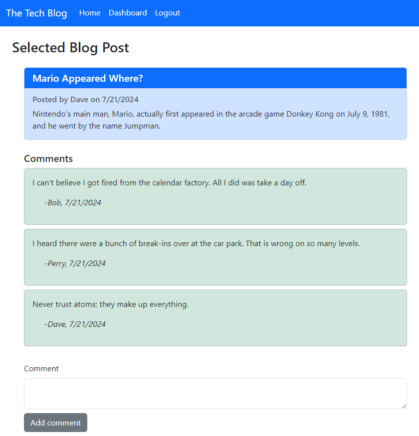

# The Tech Blog
  

  

## Description
  

This is a CMS-style blog site so a user can publish articles, blog posts, and their thoughts and opinions.
  

## Table of Contents
  

- [Installation](#installation)
  
- [Usage](#usage)
  
- [License](#license)
  
- [Contributing](#contributing)
  
- [Tests](#tests)
  
- [Questions](#questions)
  

## Installation
  

No installation required.  All that is needed is to navigate to the website.
  

## Usage
  

To utilize this app, navigate to [https://techblog-s0uy.onrender.com](https://techblog-s0uy.onrender.com).  The user will be presented with the homepage that contains all of the current blog posts to the app.  The user can view the comments (if any) of any blog entry by clicking on the title of the blog entry.

To utilize additional functionality of the app, the user must log in to the app.  If the user does not have a log in, a sign up process is available to allow the user to create an account with a user name and password.  The next time this user visits the site, the user can log in using this information.

Once logged in, the user can view any posts they have created by visiting the dashboard.  All posts created by this user will be displayed.  The user can click on any of the posts in the dashboard to update information in that post or delete the post altogether.  Also, having logged in, the user can add comments to posts from other users by clicking on these posts from the homepage.

Note: should the user remain idle for more than two (2) minutes, the app will automatically log the user out.  The user must log back in to create new posts, edit or delete their own posts, or comment on another user's post.

  

## License
  

This application is operating under the following license: **MIT License**.  
  

Further information regarding this license, to include the required notice, can be read by navigating to the following link: https://opensource.org/licenses/MIT.
  

## Contributing
  

Anyone wishing to contribute to this project can do so by contacting me via the information located in the "Questions" section below.
  

## Tests
  

There are no testing examples.
  

## Questions
  

Any questions regarding this project can be answered by contacting me through my GitHub profile or by email:
  
GitHub Profile: https://github.com/orian42
  
email: orian42@gmail.com
